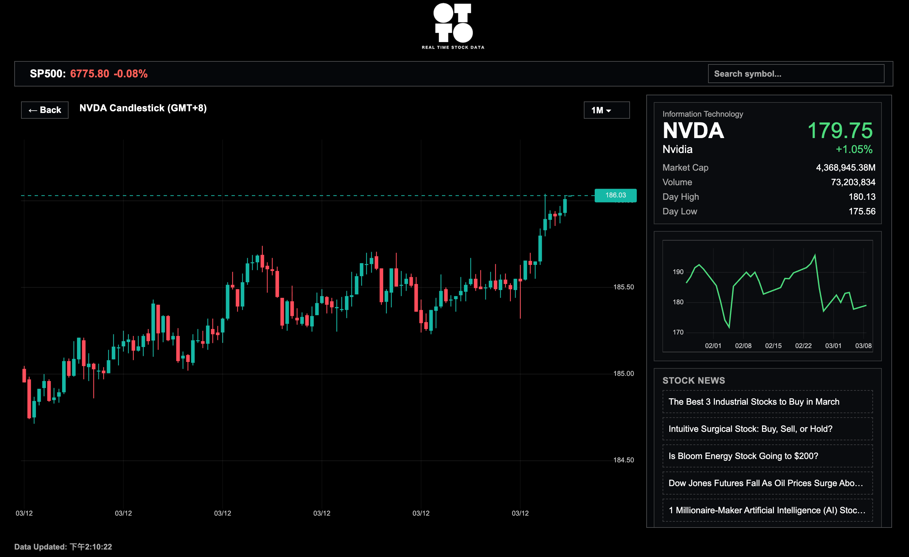
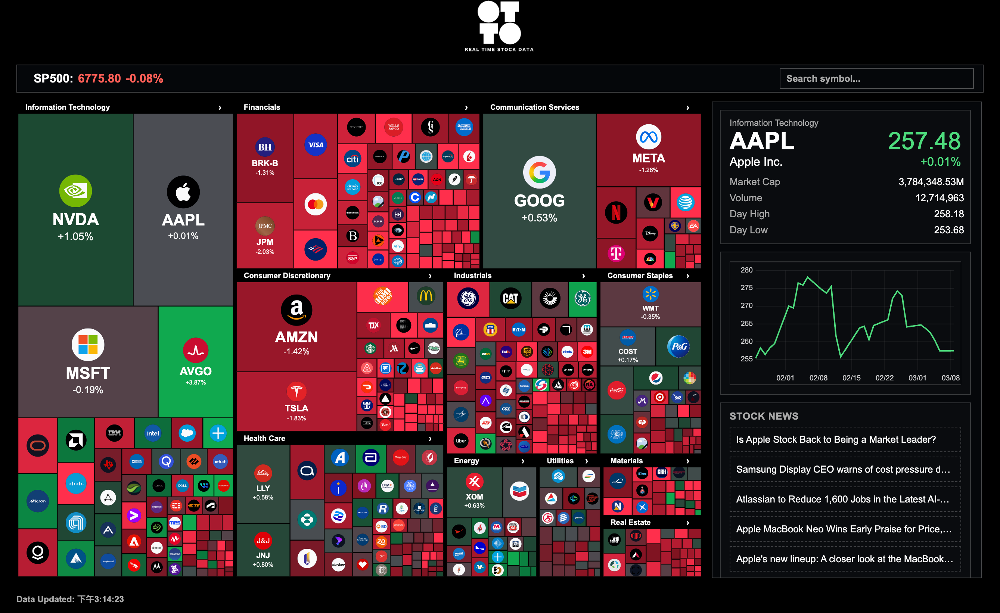

# FP_Stock Project 大綱

這個倉庫包含兩個主要子應用程式：

- **Java 後端服務**（位於 `_java/data-provider-app`）
- **React 前端應用**（位於 `_react/stock_react`）

---

## 1. 專案簡介

此專案旨在提供一套完整的金融股票資料平台，主要功能包括：

- 提供股票歷史資料查詢 API
- 支援即時股價更新與展示
- 提供技術指標（如 K 線、趨勢圖、樹狀圖）視覺化
- 前端可選擇不同股票並切換時間範圍
- 後端使用 Java/Spring Boot 提供資料 API，前端使用 React/Vite 顯示即時與歷史股價。





## 2. 技術棧

| 部分 | 技術 |
|------|------|
| 後端 | Java 17|
| 前端 | React 18 |
| Database | PostgreSQL |


## 3. 結構說明

```
/_java/data-provider-app      # Java 後端
/_react/stock_react           # React 前端
/_py                          # Python 拿取歷史數據
```

